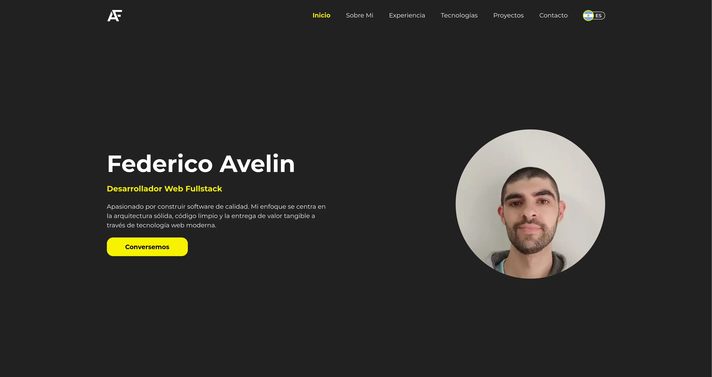
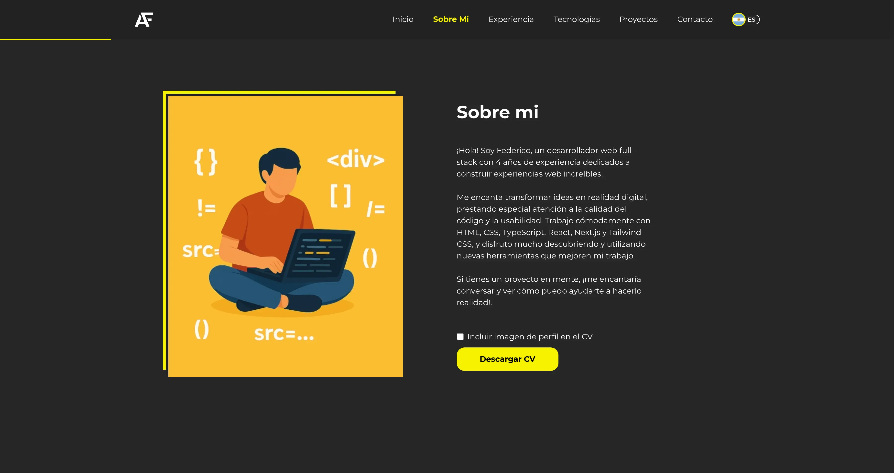
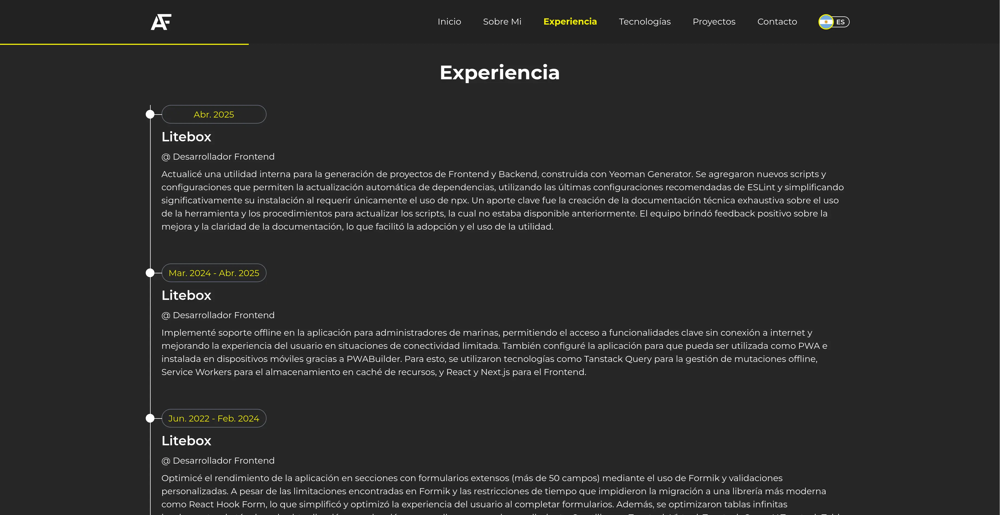
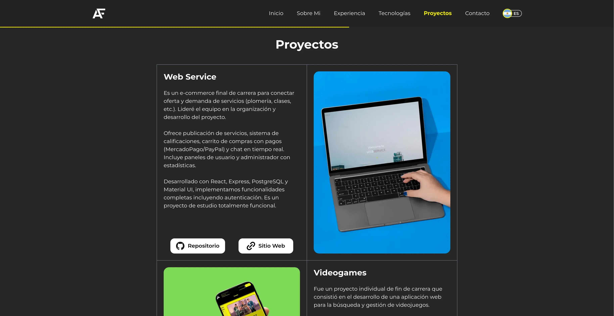

# Portfolio Personal - Federico Avelin - Desarrollador Fullstack

[Ver Demo Online](https://fede-avelin-dev.vercel.app/) <br/>



## Descripción

Bienvenido/a al repositorio de mi portfolio personal. Este proyecto fue desarrollado con **React** y **Next.js** para mostrar mis habilidades, proyectos y experiencia como desarrollador fullstack. Aquí encontrarás mi información profesional, proyectos destacados y formas de contactarme.

## Tecnologías Principales

- **Framework/Librería:** React 19, Next.js 15.2
- **Lenguaje:** TypeScript 5
- **Entorno:** Node.js (v22.x recomendado), npm (v10.x recomendado)
- **Otras tecnologías:** Tailwind CSS, next-intl, zod, zustand.

Para ver una lista completa de dependencias, consulta el archivo [package.json](./package.json).

## Instalación y Ejecución Local

**Prerrequisitos:**

- Tener instalado [Node.js](https://nodejs.org/) (versión 22.x o superior recomendada)
- Tener instalado [npm](https://www.npmjs.com/) (versión 10.x o superior recomendada)

**Pasos:**

1.  **Clonar el repositorio:**
    ```bash
    git clone https://github.com/Fedex159/federico-avelin-portfolio
    cd federico-avelin-portfolio
    ```
2.  **Instalar dependencias:**
    ```bash
    npm install
    ```
3.  **Ejecutar en modo desarrollo:**
    ```bash
    npm run dev
    ```
    Abre [http://localhost:3000](http://localhost:3000) en tu navegador.

## Secciones del Portfolio

### Inicio


Página principal con un mensaje de bienvenida, una breve introducción sobre mí y mi foto de perfil. La barra de navegación superior permite acceder a todas las secciones e incluye un selector de idioma.

### Sobre Mí



Contiene una descripción más detallada de mi perfil profesional y personal, así como un enlace para descargar mi CV actualizado.

### Experiencia



Detalla mi trayectoria laboral, incluyendo roles, empresas y responsabilidades relevantes.

### Tecnologías


Muestra las principales tecnologías, lenguajes y herramientas con las que trabajo habitualmente.

### Proyectos



Presenta una selección de mis proyectos personales y profesionales más destacados, con enlaces a sus repositorios de código y a las demos online.

### Contacto


Incluye mis datos de contacto directo y un formulario funcional. Este formulario utiliza **Next.js Server Actions** y se integra con **Google Forms** para recibir los mensajes.

### Diseño Adaptable (Responsive)


El sitio web está diseñado para ser completamente adaptable, asegurando una experiencia de usuario óptima en diferentes dispositivos y tamaños de pantalla (escritorio, tablet, móvil).

## Licencia

Este proyecto está bajo la Licencia MIT. Consulta el archivo `LICENSE` para más detalles.

## Contacto

Puedes contactarme a través de:

- El formulario en el [portfolio online](https://fede-avelin-dev.vercel.app/#contact).
- LinkedIn: [Tu Perfil de LinkedIn](https://www.linkedin.com/in/federico-avelin-dev/)
- Email: [fede.avelin.dev@gmail.com](mailto:fede.avelin.dev@gmail.com)
